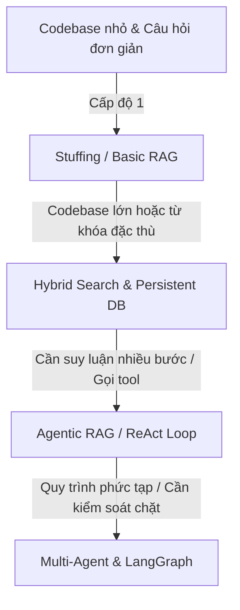

# BẢN ĐỒ QUYẾT ĐỊNH CÔNG NGHỆ & CHI PHÍ (RAG & AGENT 2026)

Tài liệu này được thiết kế như một cẩm nang thiết kế hệ thống (System Design) thực chiến, giúp bạn hệ thống hóa kiến thức từ hai dự án tham khảo [support-rag-assistant](file:///c:/Users/Pc/Desktop/Build%20CV/support-rag-assistant) và [ai-workflow-engine](file:///c:/Users/Pc/Desktop/Build%20CV/ai-workflow-engine), đồng thời đưa ra các quyết định kiến trúc tối ưu về mặt chi phí và bảo mật trong bối cảnh công nghệ năm 2026.

---

## I. KHUNG PHÂN CHIA 4 CẤP ĐỘ CÔNG NGHỆ RAG & AGENT

Dưới đây là sơ đồ quyết định dựa trên quy mô dữ liệu, yêu cầu nghiệp vụ và chi phí. Hãy áp dụng nguyên tắc: **Chỉ nâng cấp cấp độ khi giải pháp ở cấp độ dưới không còn đáp ứng được yêu cầu kỹ thuật.**



### Cấp độ 1: Stuffing / Basic RAG (In-memory / SQLite)
*   **Vấn đề:** Codebase nhỏ (<5 file, <200k tokens), tài chính hạn chế, cần chạy thử nhanh.
*   **Giải pháp:** 
    *   *Stuffing (Nhồi thẳng):* Đọc toàn bộ code nhét vào Prompt nếu nằm trong giới hạn context window của LLM.
    *   *Basic RAG:* Cắt nhỏ file (chunking) thô bằng ký tự cố định, lưu trữ tạm thời trong memory hoặc SQLite thô, tìm kiếm bằng khoảng cách vector (Cosine Similarity) cơ bản.
*   **Chi phí:** Cực kỳ rẻ. Sử dụng gói miễn phí của Google AI Studio hoặc GPT-4o-mini với chi phí chưa tới $0.05 cho mỗi 100 lần truy vấn.
*   **Khi nào nâng cấp lên Cấp độ 2:** Khi codebase bắt đầu lớn hơn (trên 20 file), việc nhét toàn bộ vào context làm tăng chi phí LLM call phi mã hoặc khi vector search bị bỏ sót các từ khóa đặc thù (mã đơn hàng, tên hàm cụ thể).

### Cấp độ 2: Hybrid Search & Persistent Vector DB (ChromaDB / SQLite)
*   **Vấn đề:** Codebase lớn (50-200 files), chứa nhiều thuật ngữ chuyên ngành, mã lỗi, API routes cụ thể mà Vector Search thông thường bị trượt (do vector bắt ngữ nghĩa, không khớp chính xác ký tự).
*   **Giải pháp:** 
    *   Lưu trữ bền vững (Persistent) thông tin chunks, metadata, hashes vào SQLite hoặc ChromaDB.
    *   Áp dụng **Hybrid Search:** Kết hợp tìm kiếm theo tần suất từ khóa (BM25/Keyword scoring) và tìm kiếm theo ngữ nghĩa (Vector search).
*   **Chi phí:** Thấp-Trung bình. Chi phí phát sinh chủ yếu ở việc sinh Embedding ban đầu cho toàn bộ codebase. 
*   **Khi nào nâng cấp lên Cấp độ 3:** Khi câu hỏi của người dùng yêu cầu phân tích logic đi qua nhiều file liên kết (ví dụ: *"Hàm `verifySignature` ở webhook.js gọi hàm nào ở credentials.js và luồng dữ liệu đi thế nào?"*). RAG tĩnh không thể trả lời các câu hỏi suy luận liên kết này.

### Cấp độ 3: Agentic RAG / Vòng lặp ReAct (Single Agent)
*   **Vấn đề:** Cần giải quyết các tác vụ suy luận phức tạp, đọc hiểu luồng code liên kết giữa các file hoặc cần tương tác với môi trường bên ngoài (ví dụ: chạy test thử xem code lỗi không).
*   **Giải pháp:** Dựng vòng lặp **ReAct (Reasoning + Acting)**. Agent có các công cụ (Tools) như: `grep` (tìm kiếm từ khóa), `read_file` (đọc file cụ thể), `search_rag` (tìm ngữ nghĩa), `run_tests` (chạy test suite). Agent sẽ tự suy nghĩ và gọi các tool này liên tục cho tới khi tìm ra câu trả lời cuối cùng.
*   **Chi phí:** Trung bình-Cao. Vì Agent phải gọi LLM nhiều lần cho một câu hỏi để sinh ra các bước Thought -> Action -> Observation.
*   **Khi nào nâng cấp lên Cấp độ 4:** Khi Agent đơn lẻ dễ bị "lạc lối" (loop vô hạn) trong codebase lớn, hoặc khi quy trình đòi hỏi các bước kiểm duyệt nghiêm ngặt (ví dụ: Agent sửa code xong phải chuyển cho một Agent phản biện kiểm tra lại trước khi gửi cho người dùng).

### Cấp độ 4: Multi-Agent & LangGraph (State Machine + Human-in-the-Loop)
*   **Vấn đề:** Hệ thống audit tự động quy mô lớn, cần phối hợp nhiều vai trò chuyên biệt (Finder, Auditor, Explainer, Reviewer) và cần con người phê duyệt (Human-in-the-Loop) trước các hành động rủi ro (như tự động commit/push code vá lỗi lên GitHub).
*   **Giải pháp:** Dựng máy trạng thái (State Machine) bằng **LangGraph**. Luồng đi của dữ liệu được ràng buộc rõ ràng bằng các Node (Agent) và Edge (điều kiện chuyển tiếp).
*   **Chi phí:** Cao nhất. Đòi hỏi thời gian phát triển dài và tiêu tốn lượng token lớn do sự tương tác qua lại giữa các Agent.

---

## II. BẢNG THÔNG SỐ CÁC MÔ HÌNH LLM (CẬP NHẬT 2026)

Bảng dưới đây đã được **xác minh lại ngày 17/6/2026** (nguồn ở cuối mục). Giá tính theo USD / 1 triệu token (input/output). Bảng được sắp theo **vai trò + chi phí** để bạn chọn đúng nguyên tắc "rẻ + hiệu quả": dùng model rẻ cho vòng lặp agent, chỉ gọi model đắt cho bước phân tích khó.

| Tên mô hình | Hãng | Input /1M | Output /1M | Vai trò tối ưu | Ghi chú |
| :--- | :--- | :--- | :--- | :--- | :--- |
| **DeepSeek V3.2** | DeepSeek | **$0.14** | **$0.28** | Rẻ nhất cho vòng lặp Agent; reasoning ngang model đắt gấp ~10× | ⚠️ Dữ liệu đi qua API nhà cung cấp TQ — cân nhắc privacy khi audit mã nguồn |
| **Gemini 2.0 Flash** | Google | **$0.10** | **$0.40** | Gemini rẻ nhất — agent loop tiết kiệm | Context ~1M |
| **Mistral Small** | Mistral | $0.10 | $0.30 | Parse/format/phân loại text nhẹ | Có bản open-weight tự host |
| **Gemini 3.1 Flash-Lite** | Google | $0.25 | $1.50 | Agent loop cần context lớn mà vẫn rẻ | Preview (3/2026) |
| **Gemini 2.5 Flash** | Google | $0.30 | $2.50 | Cân bằng cho RAG codebase | Context ~1M |
| **Gemini 3.5 Flash** | Google | $1.50 | $9.00 | RAG codebase lớn (context ~1M) + Context Caching | Mới nhất (19/5/2026) nhưng **đắt nhất họ Flash** → dùng có chọn lọc, không cho agent loop |
| **GPT-5.4** | OpenAI | $2.50 | $15.00 | Node phân tích/suy luận mạnh cho production | Tỉ lệ năng lực/chi phí tốt |
| **Claude Sonnet 4.6** | Anthropic | $3.00 | $15.00 | Node cuối: viết phân tích bảo mật chuyên sâu, giải thích code phức tạp | Thay thế "Claude 3.5 Sonnet" đã lỗi thời |

> **Cách đọc bảng (rẻ + hiệu quả):** Vòng lặp ReAct gọi LLM nhiều lần → chọn nhóm trên cùng (DeepSeek V3.2 / Gemini 2.0 Flash / Flash-Lite). Bước viết báo cáo bảo mật cuối (ít lần, cần chất lượng) → mới gọi GPT-5.4 / Claude Sonnet 4.6. Đây gọi là **Hybrid Routing** — và là một điểm cộng lớn khi nói trong phỏng vấn.
>
> *Lưu ý: giá xác minh 17/6/2026; context window là giá trị tham khảo (Gemini Flash ~1M, Claude ~200k), chưa soát lại từng dòng. Giá LLM đổi nhanh — kiểm tra lại trước khi đưa vào báo cáo/CV.*
>
> **Nguồn:** [pricepertoken.com](https://pricepertoken.com/cheapest) · [Gemini API pricing (ai.google.dev)](https://ai.google.dev/gemini-api/docs/pricing) · [cloudzero LLM pricing 2026](https://www.cloudzero.com/blog/llm-api-pricing-comparison/)

---

## III. PHÂN TÍCH ĐỐI TƯỢNG KHÁCH HÀNG & BÀI TOÁN CHI PHÍ

### Nhóm 1: Khách hàng ngân sách thấp (Dữ liệu nhỏ/vừa, dùng Cloud API)
*   **Đặc điểm:** Không có hạ tầng phần cứng mạnh, muốn triển khai nhanh, chấp nhận dữ liệu (mã nguồn) đi qua API của bên thứ ba (OpenAI, Google) miễn là có cam kết bảo mật cấp API (không dùng dữ liệu để train model).
*   **Chiến lược tối ưu chi phí (Cost-Saving):**
    1.  **Dùng Context Caching của Gemini 3.5 Flash:** Thay vì embed codebase nhiều lần, hãy cache toàn bộ codebase lên Gemini Server. Chi phí lưu trữ cache chỉ khoảng $0.015/1M tokens/giờ, trong khi chi phí đọc cache rẻ hơn 4 lần so với input thông thường.
    2.  **Hybrid Routing (Định tuyến thông minh):** Sử dụng **GPT-4o-mini** hoặc **Gemini 3.5 Flash** để chạy Agent tìm kiếm và phân tích sơ bộ. Chỉ khi phát hiện lỗi bảo mật nghiêm trọng cần viết báo cáo chi tiết hoặc đề xuất code vá lỗi mới gọi đến **Claude 3.5 Sonnet**.
    3.  **Hạn chế Max Steps:** Đặt giới hạn cứng cho vòng lặp ReAct Agent (tối đa 5-6 bước) để tránh tình trạng Agent bị lặp vô hạn gây tiêu tốn token.

### Nhóm 2: Doanh nghiệp cần On-premise (Bảo mật tuyệt đối)
*   **Đặc điểm:** Doanh nghiệp lớn, quy định compliance nghiêm ngặt, tuyệt đối không được để lộ mã nguồn dự án ra internet.
*   **Yêu cầu phần cứng tối thiểu:**
    *   *Mô hình 8B (Hermes 3 8B, Llama 3.1 8B):* RAM tối thiểu 16GB, GPU từ 8GB VRAM trở lên (RTX 3060/4060).
    *   *Mô hình 70B (Hermes 3 70B):* Máy chủ chuyên dụng có RAM 64GB+, 2 card GPU RTX 3090/4090 chạy song song (hoặc Apple Mac Studio M2/M3 Ultra 128GB Unified Memory).
*   **Kiến trúc đề xuất:**
    *   Chạy mô hình thông qua **Ollama** hoặc **vLLM** làm Local Inference Server.
    *   Embedding model local nên dùng **Qwen3-Embedding** (đứng #1 bảng MTEB đa ngôn ngữ 2026, ~70.6 điểm, open-weight, context 32K, rất mạnh cho phi-Anh ngữ → tốt cho tiếng Việt). **BAAI/bge-m3** vẫn là phương án nhẹ/ổn định nhưng đã bị Qwen3 vượt. *(Xác minh 17/6/2026 — nguồn: [MTEB leaderboard](https://awesomeagents.ai/leaderboards/embedding-model-leaderboard-mteb-april-2026/), [Mixpeek best embedding models](https://mixpeek.com/curated-lists/best-embedding-models)).*
    *   Dùng **SQLite** làm Database và **ChromaDB** chạy local trong Docker Container.
    *   *Đánh giá:* Chi phí đầu tư ban đầu cho phần cứng khá cao, nhưng chi phí vận hành sau đó gần như bằng 0 và đảm bảo an toàn dữ liệu 100%.

---

## IV. SO SÁNH KIẾN TRÚC: OPENROUTER VS GEMINI API (GOOGLE AI STUDIO)

Khi thiết kế hệ thống RAG/Agent trên đám mây, việc lựa chọn cổng kết nối API quyết định tính linh hoạt và độ ổn định của hệ thống.

```text
Kiến trúc 1: Kết nối trực tiếp
Client ---> Google Gemini API ---> Mô hình Gemini

Kiến trúc 2: Kết nối qua Proxy/Aggregator
Client ---> OpenRouter API ---> Chọn (Claude / GPT-4 / Hermes 3 / Llama 3.1)
```

| Tiêu chí so sánh | Gemini API (Google AI Studio) | OpenRouter API |
| :--- | :--- | :--- |
| **Độ đa dạng mô hình** | Hạn chế (chỉ dùng được các mô hình thuộc dòng Gemini của Google). | **Cực cao** (một API key dùng được cho cả OpenAI, Anthropic, Meta, Mistral, Nous Hermes...). |
| **Độ trễ (Latency) & Ổn định** | **Rất tốt** (kết nối trực tiếp đến hạ tầng của Google, ít qua trung gian). | Trung bình (phụ thuộc vào nhà cung cấp thứ ba mà OpenRouter định tuyến tới). |
| **Tính năng tối ưu RAG** | **Xuất sắc** (Hỗ trợ Context Caching gốc lên tới 1-2M tokens, Batch API giảm 50% giá). | Hạn chế (Chưa hỗ trợ Context Caching đồng đều cho tất cả các mô hình). |
| **Bảo mật & Privacy** | Cam kết bảo mật dữ liệu ở Paid Tier (không dùng dữ liệu khách hàng để train). | Dữ liệu đi qua OpenRouter và nhà cung cấp endpoint cuối (cần đọc kỹ điều khoản từng model). |
| **Trade-off cốt lõi** | **Chọn Gemini API khi:** Dự án lớn, cần context window khổng lồ, RAG tài liệu cực nặng, muốn tối ưu chi phí bằng Context Caching.<br>**Chọn OpenRouter khi:** Muốn tránh bị khóa chặt vào một nhà cung cấp (Vendor Lock-in), muốn linh hoạt đổi model (ví dụ: chạy Agent bằng GPT-4o-mini nhưng sinh câu trả lời bằng Claude 3.5 Sonnet) chỉ với một cổng kết nối duy nhất. |

---

## V. HƯỚNG DẪN THAM CHIẾU CODE ĐỂ THỰC HÀNH TỰ HỌC

Để không bị lạc lối khi đọc hai codebase tham khảo, hãy tập trung vào các file cốt lõi sau tương ứng với từng tuần học của bạn:

### 1. Khi học Tuần 1 & 2 (Nền tảng RAG, Chunking, Embeddings)
*   **Mở dự án `support-rag-assistant` và xem:**
    *   [document_loader.py](file:///c:/Users/Pc/Desktop/Build%20CV/support-rag-assistant/support_rag_assistant/services/document_loader.py): Học cách đọc file và tách đoạn (chunking) theo ký tự thực tế.
    *   [storage.py](file:///c:/Users/Pc/Desktop/Build%20CV/support-rag-assistant/support_rag_assistant/services/storage.py): Học cách thiết kế bảng SQLite để lưu trữ văn bản, metadata và kiểm tra trùng lặp bằng hàm băm (`content_hash`).
*   **Mở dự án `ai-workflow-engine` và xem:**
    *   [01_basic_rag.ipynb](file:///c:/Users/Pc/Desktop/Build%20CV/ai-workflow-engine/notebooks/01_basic_rag.ipynb) & [02_hybrid_search.ipynb](file:///c:/Users/Pc/Desktop/Build%20CV/ai-workflow-engine/notebooks/02_hybrid_search.ipynb): Chạy từng dòng trong file Notebook này trên máy của bạn để trực quan hóa cách vector biểu diễn ngôn ngữ.

### 2. Khi học Tuần 3 (Agent & Tool-Calling)
*   **Mở dự án `ai-workflow-engine` và xem:**
    *   [keyword_retriever.py](file:///c:/Users/Pc/Desktop/Build%20CV/ai-workflow-engine/app/retrievers/keyword_retriever.py) & [hybrid_retriever.py](file:///c:/Users/Pc/Desktop/Build%20CV/ai-workflow-engine/app/retrievers/hybrid_retriever.py): Học cách họ viết thuật toán chấm điểm từ khóa và gộp điểm (merge scores) để làm Tool tìm kiếm cho Agent.

### 3. Khi học Tuần 5 (Tích hợp API & UI)
*   **Mở dự án `support-rag-assistant` và xem:**
    *   [main.py](file:///c:/Users/Pc/Desktop/Build%20CV/support-rag-assistant/support_rag_assistant/main.py) & [routes_ask.py](file:///c:/Users/Pc/Desktop/Build%20CV/support-rag-assistant/support_rag_assistant/api/routes_ask.py): Học cách tổ chức cấu trúc dự án FastAPI chuyên nghiệp, cách khai báo Router và Schema đầu ra có Citations đầy đủ.
*   **Mở dự án `ai-workflow-engine` và xem:**
    *   [streamlit_app.py](file:///c:/Users/Pc/Desktop/Build%20CV/ai-workflow-engine/ui/streamlit_app.py): Copy khung code này để dựng nhanh giao diện UI web cho dự án Code Auditor của bạn.
